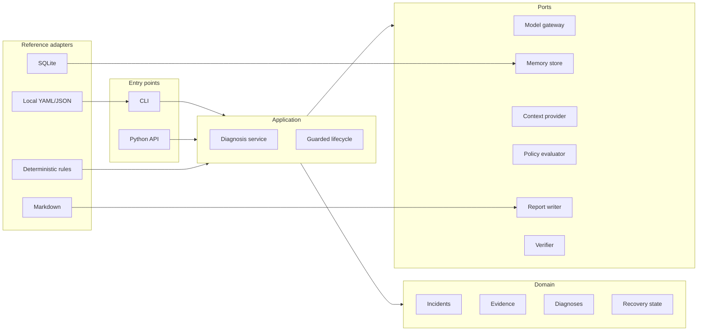

<h1 align="center">OpenARIA</h1>

<p align="center">
  <strong>Deterministic-first, evidence-grounded guarded recovery & automony for data, ml & software pipelines.</strong>
</p>

<p align="center">
  <a href="https://github.com/soloshun/openaria/actions">CI</a> ·
  <a href="LICENSE">Apache-2.0</a> ·
  <a href="docs/architecture/overview.md">Architecture</a> ·
  <a href="docs/configuration.md">Configuration</a> ·
  <a href="cookbook/README.md">Cookbooks</a> ·
  <a href="ROADMAP.md">Roadmap</a>
</p>

OpenARIA is the open-source Python implementation companion to **ARIA** - the **Agentic Recovery and Incident Automation** reference architecture. It provides reusable contracts and local reference adapters for diagnosing failures in data, machine-learning, and software-delivery pipelines while keeping models optional and consequential actions under explicit control.

OpenARIA starts with Diagnosis-as-Code: local incident evidence becomes a structured, reviewable diagnosis, Markdown report, and operational-memory record. Its direction is Healing-as-Code: a guarded lifecycle for detect, triage, diagnose, plan, approve, remediate, verify, and learn.

> **Pre-alpha:** OpenARIA does not perform unrestricted or default production remediation. Current execution-related models are recommendation and verification contracts, not an authority granted to an LLM.

## ARIA and OpenARIA

| Name | Role | Repository boundary |
| --- | --- | --- |
| **ARIA** | Research reference architecture and eight-stage lifecycle. | Technology-flexible design described by the paper. |
| **OpenARIA** | Apache-2.0 framework and local implementation companion. | Domain contracts, application services, ports, safe reference adapters, CLI, testkit, and cookbooks. |


## Design principles

- **Deterministic first.** Known signatures and project rules run before optional model reasoning.
- **Evidence grounded.** Facts, evidence, hypotheses, confidence, contradictions, and missing evidence remain distinguishable.
- **Model optional.** The core works offline; provider integrations implement a narrow gateway port.
- **Local first.** SQLite and Markdown are inspectable defaults, not mandatory hosted services.
- **Guarded recovery.** Plans are allowlisted recommendations; approval and verification are explicit boundaries.
- **Confirmed memory.** Model output is never silently promoted into confirmed operational truth.
- **Vendor agnostic.** Domain and application packages import no observability, orchestration, cloud, or agent SDK.

## Architecture



Canonical package boundaries:

```text
src/openaria/
├── domain/       # strict vendor-neutral models
├── application/  # use-case orchestration
├── ports/        # replaceable provider interfaces
├── adapters/     # deterministic, SQLite, Markdown, and local adapters
├── config/       # versioned strict configuration
├── cli/          # command composition
├── security/     # redaction and evidence-safety utilities
└── testkit/      # deterministic test doubles
```

The proof-of-concept flat modules have been removed. New code imports the explicit domain, application, port, adapter, configuration, and security packages shown above.

Read the [architecture overview](docs/architecture/overview.md), [baseline audit](docs/architecture/refactor-audit.md), and [refactor plan](docs/architecture/refactor-plan.md).

## Current capabilities

| Capability | Current behavior |
| --- | --- |
| Incident input | Local log normalization and typed vendor-neutral incident contracts. |
| Deterministic diagnosis | Ordered rules with stable ID, version, priority, matched terms, and evidence references. |
| Versioned configuration | Strict `openaria.dev/v1alpha1` project and rule-set documents; unknown fields fail validation. |
| Reports | Deterministic Markdown with facts, evidence, hypotheses, confidence, review requirement, and safety boundary. |
| Local memory | SQLite records, human resolutions, visible truth state, and transparent lexical search. |
| Model boundary | Explicit policy, budgets, schema-validated output, fake CI gateway, and deterministic fallback. |
| Guarded lifecycle | Context, policy, approval, verification, and audit ports with no core action executor. |
| CLI | Initialization, diagnosis, doctor, rule validation, reports, resolution, and memory search. |
| Cookbooks | Synthetic data, ML regression, and software-delivery investigations with optional Agno/OpenRouter paths. |

## Quick start

OpenARIA supports Python 3.11+ and uses [uv](https://docs.astral.sh/uv/).

```bash
git clone https://github.com/soloshun/openaria.git
cd openaria
uv sync --all-groups
uv run openaria --help
```

Run the local deterministic example:

```bash
uv run openaria doctor \
  --config cookbook/simple-log-diagnosis/openaria/openaria.yml

uv run openaria diagnose \
  --config cookbook/simple-log-diagnosis/openaria/openaria.yml
```

The command reads a synthetic local log, writes a Markdown report, saves an unconfirmed incident episode to local SQLite, and prints its incident ID. It makes no network or model call.

```bash
uv run openaria report <incident-id> \
  --config cookbook/simple-log-diagnosis/openaria/openaria.yml

uv run openaria resolve <incident-id> \
  --resolution "Human-confirmed cause, action, and outcome." \
  --config cookbook/simple-log-diagnosis/openaria/openaria.yml

uv run openaria memory search "KeyError Close" \
  --config cookbook/simple-log-diagnosis/openaria/openaria.yml
```


## Versioned project configuration

```yaml
apiVersion: openaria.dev/v1alpha1
kind: Project
metadata:
  name: customer-pipeline
spec:
  environment: local
  memory:
    provider: sqlite
    path: .openaria/incidents.db
  reports:
    provider: markdown
    outputDir: .openaria/reports
  incidentSources:
    - provider: local-log
      path: logs/latest-failure.log
  rules:
    files: [rules.yml]
  model:
    enabled: false
```

Configuration is strict: misspelled or unknown fields fail with a validation error. Relative paths resolve from the project document. Files larger than the configured safety limit are rejected. Checked schemas for the [project](schemas/openaria-project-v1alpha1.schema.json) and [rule set](schemas/openaria-rules-v1alpha1.schema.json) support editors and tooling.

OpenARIA intentionally accepts only the versioned project and rule-set structures during this pre-release revamp. Read the [configuration reference](docs/configuration.md) for every field and its meaning.

## CLI

```text
openaria init
openaria doctor
openaria diagnose
openaria report
openaria resolve
openaria memory search
openaria rules validate
```

`doctor` and validation commands do not make network calls or write incident state. Model assistance remains disabled unless application code supplies both an enabled policy and a gateway adapter.

## Python API

```python
from pathlib import Path

from openaria.application import DiagnosisService
from openaria.config import load_config
from openaria.domain import IncidentInput

config = load_config(Path("openaria.yml"))
service = DiagnosisService(rules=config.rules)
incident = IncidentInput(
    source_tool="local-log",
    pipeline_name=config.project,
    raw_payload={"log": "ERROR KeyError: Close"},
)
diagnosis = await service.diagnose(incident)
```

## Cookbooks

- [Simple local diagnosis](cookbook/simple-log-diagnosis/README.md)
- [Data pipeline investigation](cookbook/data-pipeline-investigation/README.md)
- [ML regression monitoring](cookbook/ml-regression-monitoring/README.md)
- [Software-delivery CI investigation](cookbook/software-delivery-ci-investigation/README.md)
- [Recording a human resolution](cookbook/recording-resolution/README.md)

All examples are synthetic. Agent frameworks and model providers remain cookbook-only optional dependencies.

## Safety

OpenARIA treats logs, tickets, runbooks, source files, and model output as untrusted input.

- No direct shell, cloud-admin, Kubernetes-admin, or database actuation in core.
- No live model key or billable request in CI.
- No telemetry export by default.
- Bounded configuration and log reads.
- Conservative redaction before optional model use.
- Model output remains an unconfirmed hypothesis until a human or verifier confirms it.
- Execution capability requires a future RFC, allowlisted typed actions, policy, approval, audit, limits, and verification.

Read the [threat model](docs/safety/threat-model.md) and [security policy](SECURITY.md).

## Development

```bash
uv sync --all-groups
uv run ruff format --check .
uv run ruff check .
uv run mypy src
uv run python scripts/generate_config_schema.py --check
uv run pytest
uv build
```

See [CONTRIBUTING.md](CONTRIBUTING.md), [GOVERNANCE.md](GOVERNANCE.md), [SUPPORT.md](SUPPORT.md), [CHANGELOG.md](CHANGELOG.md), and [ROADMAP.md](ROADMAP.md).

## Releases

OpenARIA releases are manually dispatched through GitHub Actions and published with PyPI Trusted Publishing; no long-lived PyPI token is stored in the repository. See the [release guide](docs/releasing.md) for the one-time account setup, TestPyPI-first procedure, and clean-room verification script.

## Research and standards context

OpenARIA is informed by [OpenTelemetry](https://opentelemetry.io/), [OpenLineage](https://openlineage.io/), [Prometheus](https://prometheus.io/), [Site Reliability Engineering](https://sre.google/sre-book/table-of-contents/), [ReAct](https://arxiv.org/abs/2210.03629), and [LLM-based incident RCA research](https://doi.org/10.1145/3627703.3629553). These are design influences, not mandatory dependencies or claims of conformance.

## Maintainer and license

OpenARIA is currently maintained by [Solomon Eshun](mailto:solomoneshun373@gmail.com) and licensed under [Apache License 2.0](LICENSE).
