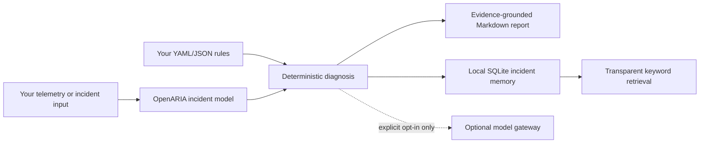

<p align="center">
  
</p>

<h1 align="center">OpenARIA</h1>

<p align="center">
  <strong>Diagnosis-as-Code for vendor-agnostic pipeline reliability.</strong>
</p>

<p align="center">
  <a href="https://github.com/soloshun/openaria/actions">CI</a> ·
  <a href="LICENSE">Apache-2.0</a> ·
  <a href="docs/OPENARIA_CORE_REFERENCE.md">Core reference</a> ·
  <a href="docs/configuration.md">Configuration</a> ·
  <a href="cookbook/">Cookbooks</a>
</p>

OpenARIA is the open-source Python implementation companion to **ARIA** - **Agentic Recovery and Incident Automation** - for turning failed data, machine learning, and software-delivery pipelines into structured, evidence-grounded incident diagnoses and reusable local operational memory.

It is the implementation companion to the ARIA reference architecture proposed in *Agentic Self-Healing for Data & AI Pipelines: An Affordable Vendor-Agnostic Architecture Using Open-Source Software*. The project starts with the smallest useful, reviewable loop: local telemetry in, structured diagnosis out, with no required cloud account, model provider, or production access.

> **Status: pre-alpha research proof of concept.** OpenARIA v0.1 implements **Diagnosis-as-Code**. It does not autonomously remediate production systems.

## Why OpenARIA

Pipeline incidents are rarely a single-tool problem. A failure may begin with a changed upstream schema, emerge in an orchestrator log, affect a dashboard or model, and require knowledge held in a runbook or a previous incident. Existing tools can be valuable, but teams often work across mixed stacks.

OpenARIA provides a portable diagnosis layer that a project can configure around its own estate. It does not replace monitoring, orchestration, lineage, or incident-management systems. Instead, it gives a project a common way to normalize an incident, apply reviewable rules, capture evidence, state uncertainty, record safe next steps, and retain the result locally.

## The core idea: Diagnosis-as-Code

**Diagnosis-as-Code** is OpenARIA's name for making incident diagnosis reproducible, inspectable, and structured instead of leaving it as scattered log reading or tribal knowledge.

For every diagnosis, OpenARIA keeps these distinct:

- Confirmed facts supported by supplied evidence.
- The evidence itself, such as the log lines that matched a rule.
- A root-cause hypothesis and explicit confidence value.
- Missing evidence that would strengthen or disprove the hypothesis.
- Recommended investigation steps and an optional suggested playbook.

The output is a Markdown incident report and a local memory record. A suggested playbook is a recommendation, never a command to execute.

## What is implemented today

| Capability | Current behavior |
| --- | --- |
| Local incident input | Diagnose a local text log through the CLI or use the typed incident models from Python. |
| Project-owned rules | Load ordered deterministic rules from YAML or JSON. The first fully matching rule wins. |
| Structured diagnosis | Validate incident, evidence, triage, hypothesis, confidence, missing evidence, and next steps with Pydantic models. |
| Markdown reports | Write a readable incident report that visibly separates facts from hypotheses. |
| Local memory | Save incidents and human-confirmed resolutions to SQLite; search them using transparent keyword scores. |
| Optional model boundary | Keep model use opt-in, provider-neutral, redacted, schema-validated, and fallback-safe. |
| Guarded lifecycle contracts | Define context, policy, approval, verification, and audit interfaces without implementing execution. |
| Cookbooks | Demonstrate deterministic and optional-agent integrations using separate, synthetic projects. |

## What is intentionally not implemented

- No direct shell, cloud, database, deployment, or remediation access.
- No automatic production changes, schema migrations, retries, or rollbacks.
- No built-in connector for a specific vendor, orchestrator, observability product, or model provider.
- No hosted service, background daemon, semantic/vector retrieval, or ticket/chat integration in the core.
- No requirement for an LLM, API key, or network connection for deterministic diagnosis.

These are boundaries, not omissions. The paper's long-term architecture includes guarded execution and verification, but OpenARIA will only approach those stages through explicit, tested, allowlisted interfaces.

## Architecture at a glance



The paper describes seven logical layers, from the existing pipeline estate through telemetry, memory, reasoning, approval, guarded execution, and verification/learning. OpenARIA v0.1 makes the diagnosis, memory, model-boundary, and governance interfaces tangible while keeping execution out of the framework. See the [core reference](docs/OPENARIA_CORE_REFERENCE.md#2-the-problem-and-the-paper-relationship) for the full mapping.

## Quick start

OpenARIA uses [uv](https://docs.astral.sh/uv/) and supports Python 3.11 or later.

```bash
git clone https://github.com/soloshun/openaria.git
cd openaria
uv sync --all-groups
uv run openaria --help
```

Run the local, synthetic diagnosis cookbook:

```bash
uv run openaria diagnose \
  --config cookbook/simple-log-diagnosis/openaria.yml
```

The command reads the cookbook's configured `failure.log`, writes a Markdown report under that cookbook's `.openaria/reports/` directory, saves an incident to local SQLite memory, and prints an incident ID. It makes no external network or model call.

Use that incident ID to inspect the report, record the human-confirmed outcome, or search past local incidents:

```bash
uv run openaria report <incident-id> \
  --config cookbook/simple-log-diagnosis/openaria.yml

uv run openaria resolve <incident-id> \
  --resolution "Describe the human-confirmed resolution." \
  --config cookbook/simple-log-diagnosis/openaria.yml

uv run openaria memory search "KeyError Close" \
  --config cookbook/simple-log-diagnosis/openaria.yml
```

## Configure your own project

OpenARIA is a framework: your project declares where its local state belongs and what its known failure signatures mean.

```yaml
# openaria.yml
project: customer_pipeline
environment: local

memory:
  path: .openaria/incidents.db

reports:
  output_dir: .openaria/reports

telemetry:
  log: logs/latest-failure.log

rules_file: rules.yml
```

```yaml
# rules.yml
rules:
  - name: missing-close-column
    all_contains: ["KeyError", "Close"]
    classification: schema_change
    severity: medium
    summary: A transformation expected Close, but the supplied log shows it was unavailable.
    root_cause_hypothesis: The upstream schema may have changed or a normalization mapping may have renamed the field.
    confidence: 0.65
    missing_evidence:
      - current input schema
      - last successful input schema
    recommended_next_steps:
      - Compare the current input schema with the last successful run.
      - Confirm whether the upstream source changed its exported fields.
    suggested_playbook: schema_mismatch_in_dataframe
```

Run it with:

```bash
uv run openaria diagnose --config path/to/openaria.yml
```

Rules are ordered and case-insensitive. Put the most specific rule first because OpenARIA uses the first rule whose `all_contains` values all occur in the log. Review the full [configuration reference](docs/configuration.md) before using OpenARIA in another project.

## Deterministic first, model optional

The core's default diagnosis path is deterministic. Known failures are resolved through project-owned rules without an LLM.

For ambiguous incidents, OpenARIA offers an optional provider-neutral `ModelGateway` contract. A model is never contacted unless an integration explicitly enables it and supplies a gateway implementation. Before context crosses that boundary, OpenARIA applies a conservative redaction baseline; the response must validate as the same structured diagnosis schema or the core returns the deterministic fallback.

This is intentionally not a complete data-loss-prevention solution. Integrations must minimize context, apply organization-specific safeguards, and verify provider retention and privacy controls. The optional [Agno + OpenRouter cookbook](cookbook/agno-openrouter-reference-architecture/README.md) demonstrates this boundary with synthetic data and an explicit opt-in API key.

## Framework and cookbooks

OpenARIA core contains generic, vendor-neutral behavior. Cookbooks contain runnable, scenario-specific demonstrations. That separation is fundamental:

| OpenARIA core | Cookbook or consuming project |
| --- | --- |
| Models, configuration loader, deterministic diagnosis, reporting, SQLite memory, redaction, lifecycle contracts | Logs, rules, schema snapshots, lineage, runbooks, playbooks, FastAPI services, agent framework, provider credentials, and synthetic scenarios |

Available examples:

- [Simple log diagnosis](cookbook/simple-log-diagnosis/README.md) - configuration-driven deterministic diagnosis.
- [Recording a resolution](cookbook/recording-resolution/README.md) - human-confirmed outcome in local memory.
- [Agno + OpenRouter reference architecture](cookbook/agno-openrouter-reference-architecture/README.md) - opt-in bounded agent over a synthetic FastAPI estate.

Read [framework and cookbook architecture](docs/framework-and-cookbooks.md) for the boundary and [OpenARIA Core Reference](docs/OPENARIA_CORE_REFERENCE.md) for the implementation-level explanation intended for reviewers and the documentation site.

## Safety and clean-room policy

OpenARIA is meant to be openly inspectable and reproducible.

- Use original code, public documentation, and synthetic or public examples only.
- Never commit credentials, private logs, customer information, employer/client code, private runbooks, or confidential architecture material.
- Keep live-model calls opt-in and out of CI.
- Treat all diagnoses as decision support; preserve human review for consequential changes.

See [SECURITY.md](SECURITY.md), [CONTRIBUTING.md](CONTRIBUTING.md), and the [Code of Conduct](CODE_OF_CONDUCT.md) for repository policies.

## Development and verification

```bash
uv sync --all-groups
uv run ruff format --check .
uv run ruff check .
uv run mypy src
uv run pytest
uv build
```

GitHub Actions runs format, lint, type, and test checks on pull requests and pushes to `main`. OpenARIA is currently maintained by [Solomon Eshun](mailto:solomoneshun373@gmail.com).

## Documentation, research context, and references

The detailed [OpenARIA Core Reference](docs/OPENARIA_CORE_REFERENCE.md) is the canonical documentation handoff for the future website and documentation agent. It includes the paper-to-code mapping, architecture boundaries, configuration and CLI behavior, public contracts, safety model, repository map, roadmap discipline, recommended site information architecture, and related standards.

OpenARIA is informed by the paper's vendor-agnostic architecture and by open standards and research including [OpenTelemetry](https://opentelemetry.io/), [Prometheus](https://prometheus.io/), [OpenLineage](https://openlineage.io/), the [SRE book](https://sre.google/sre-book/table-of-contents/), [ReAct](https://arxiv.org/abs/2210.03629), and [LLM-based root-cause-analysis research](https://doi.org/10.1145/3627703.3629553). These are design influences, not dependencies or claims of standards conformance.

## License

OpenARIA is licensed under the [Apache License 2.0](LICENSE).
