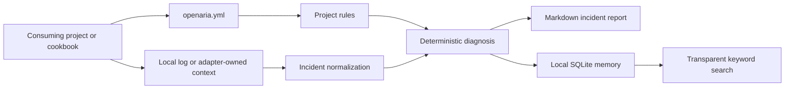

# OpenARIA Core Reference

> **Canonical documentation source for the documentation-site agent.** This file is the detailed, repository-backed explanation of OpenARIA v0.1. A site, documentation, or content agent should use it as the source of truth for public OpenARIA core pages, alongside the current `README.md`, `pyproject.toml`, and code. Do not turn future-facing concepts in this document into claims that they are already implemented.

## 1. Project identity and claim discipline

**OpenARIA** is the open-source proof of concept for **ARIA** - **Agentic Recovery and Incident Automation** - the reference architecture proposed in the paper *Agentic Self-Healing for Data & AI Pipelines: An Affordable Vendor-Agnostic Architecture Using Open-Source Software*.

OpenARIA is a lightweight Python framework for turning a pipeline failure into a structured, evidence-grounded incident diagnosis. It is designed to be vendor-agnostic: a consuming project provides its own telemetry, rules, knowledge, and integrations; OpenARIA supplies portable models, configuration, deterministic diagnosis, reports, local memory, and guarded extension interfaces.

The most important public claim is deliberately modest:

> **OpenARIA v0.1 implements Diagnosis-as-Code, not autonomous production remediation.**

The repository is a research proof of concept. It demonstrates a small, inspectable slice of the proposed architecture using synthetic examples. It does not claim production readiness, empirical validation, universal root-cause accuracy, or a complete self-healing platform.

### What OpenARIA is

- A vendor-neutral Python framework and CLI for local incident diagnosis.
- A configuration-driven way to express deterministic incident rules and safe investigation steps.
- A local, transparent incident-memory baseline backed by SQLite.
- A typed boundary for optional model assistance, policy, approval, verification, and audit adapters.
- A home for runnable, separate cookbooks that demonstrate integrations without making them core dependencies.

### What OpenARIA is not

- Not a monitoring, tracing, lineage, ticketing, or orchestration replacement.
- Not a managed service or a hosted control plane.
- Not an autonomous agent with shell, cloud, database, or deployment access.
- Not a promise that an LLM is required, correct, or allowed to act.
- Not a source of project-specific rules, customer data, proprietary logs, or production playbooks.

## 2. The problem and the paper relationship

Data engineering, machine learning, and software-delivery pipelines commonly fail because of data-quality defects, schema drift, upstream changes, infrastructure problems, orchestration failures, or model-workflow issues. The symptom often appears downstream of the cause. Investigation therefore crosses logs, metrics, lineage, runbooks, prior incidents, and human knowledge.

The paper proposes ARIA as a modular reference architecture for this problem. It describes an eight-stage operational loop:

```text
detect -> triage -> diagnose -> plan -> approve -> remediate -> verify -> learn
```

OpenARIA v0.1 implements the safest early portion of that loop:

```text
local signal -> normalize -> deterministic diagnosis -> Markdown report -> local memory
```

It also defines typed, non-executing contracts for later lifecycle stages. This allows a cookbook or downstream application to experiment with context retrieval, policy, approval, verification, and model assistance without hard-coding a provider or granting uncontrolled authority to the framework.

### Reference-architecture mapping

The paper presents seven logical layers. They are responsibilities and interfaces, not a mandatory product stack.

| Paper layer | Purpose | OpenARIA v0.1 position |
| --- | --- | --- |
| 1. Existing pipeline estate | The orchestrators, data systems, ML workflows, and delivery systems a team already operates. | External to OpenARIA. No estate is replaced. |
| 2. Telemetry and signals | Logs, metrics, traces, lineage, schema, data-quality, and model-quality signals. | A cookbook or project supplies local/synthetic context. The base CLI accepts a local log file. |
| 3. Incident memory and knowledge | Incident history, runbooks, playbooks, and project metadata. | SQLite incident memory is implemented; cookbook-owned Markdown knowledge is demonstrated. |
| 4. Deterministic policy and agentic reasoning | Known failures route through rules; ambiguous failures may use bounded reasoning. | Ordered deterministic rules are implemented. Optional provider-neutral model boundary is implemented; provider integrations live in cookbooks. |
| 5. Approval and governance | Risk tiers, approval decisions, and audit records. | Typed non-executing lifecycle contracts are implemented. |
| 6. Guarded execution | Allowlisted, rate-limited, reviewable actions. | Explicitly not implemented. `ActionPlan.execution_allowed` defaults to `false`. |
| 7. Verification and learning | Recovery checks and feedback into incident history. | Typed verification contract and local memory update path are available; no live remediation verification is performed by the core. |

The boundary is intentional: OpenARIA makes the diagnosis and governance interfaces concrete before it considers execution.

## 3. Design principles

### 3.1 Vendor agnosticism through open interfaces

The framework should fit around an existing estate rather than require an estate migration. A future adapter may read from an orchestrator, an observability platform, a webhook, a local file, or an open standard. OpenARIA does not require a specific cloud, agent framework, model provider, monitoring product, or data platform.

The paper identifies OpenTelemetry, Prometheus-style metrics, and OpenLineage as examples of portable signal interfaces. OpenARIA does **not** currently implement those connectors or claim conformance with their specifications. They are design directions for adapters.

### 3.2 Deterministic before generative

Known incident signatures should be handled by ordered, version-controlled rules before an LLM is considered. That improves repeatability, reduces cost, makes evidence visible, and limits hallucination risk. A rule match produces a structured diagnosis without network access or credentials.

An optional model gateway exists only for cases where a project deliberately supplies it. The core treats model output as untrusted until it validates against the same `DiagnosisResult` schema; invalid output falls back to deterministic diagnosis.

### 3.3 Evidence before certainty

An incident report separates:

- **confirmed facts** - observations supported by supplied evidence;
- **evidence** - named log lines or other supplied items;
- **root-cause hypothesis** - a possible explanation, always accompanied by a confidence value;
- **missing evidence** - context still required to make the conclusion stronger; and
- **recommended next steps** - safe investigation work for a human.

This is the meaning of **Diagnosis-as-Code**: the diagnostic process and output are structured, reviewable, and reproducible instead of being an opaque free-form summary.

### 3.4 Guarded autonomy, not blind autonomy

The core never gives an agent direct execution capability. The lifecycle model can represent a recommendation-only `ActionPlan`, an approval decision, and a verification result, but it has no shell, arbitrary HTTP, database mutation, deployment, or remediation implementation.

Future execution must be explicit, allowlisted, auditable, risk-tiered, bounded in blast radius, and independently verified. High-risk changes should remain reviewable human decisions.

### 3.5 Memory compounds; memory must remain inspectable

Every diagnosed incident can become reusable operational knowledge when its diagnosis and eventual human-confirmed resolution are retained. v0.1 deliberately starts with local SQLite and keyword scoring rather than opaque retrieval. Users can inspect the stored report, the resolution, and the search score.

### 3.6 Incremental adoption

The smallest useful loop is valuable on its own: accept a local failure, produce a structured report, and retain the outcome. Projects can add rules, richer context, knowledge retrieval, an optional model, approval adapters, and guarded action mechanisms only when they have the evidence and operational maturity to support them.

## 4. Core mental model

OpenARIA is a framework consumed by a project. The framework does not know a project's error signatures or playbooks until the project declares them.



The framework intentionally stays below the project-specific application layer:

| The framework owns | The consuming project or cookbook owns |
| --- | --- |
| Pydantic schemas, config loading, rule evaluation, report rendering, SQLite storage, provider-neutral contracts | Error signatures, telemetry sources, data, schema snapshots, lineage, runbooks, playbooks, model/provider choice, and any external integration |

This is how OpenARIA remains reusable while its cookbooks remain concrete.

## 5. What is implemented in v0.1

### 5.1 Incident normalization

`IncidentInput` is the vendor-neutral input model. It includes:

| Field | Meaning |
| --- | --- |
| `source_tool` | Origin label such as `manual_log`. |
| `pipeline_name` | Optional project or pipeline name. |
| `environment` | Environment label; default is `local`. |
| `raw_payload` | Project-provided input payload. |

The built-in `incident_from_log()` adapter creates an `IncidentInput` from a local text log. Future webhook, orchestrator, or observability adapters should produce the same model rather than bypassing it.

### 5.2 Deterministic diagnosis

`diagnose_text()` evaluates a project's ordered `DeterministicRule` list. A rule matches when every value in `all_contains` occurs in the input text, case-insensitively. The first matching rule wins; authors should therefore order rules from most specific to most general.

On match, OpenARIA records the matching lines as evidence and renders the configured root cause as a **hypothesis**, not a fact. When no rule matches, it returns an `unknown` diagnosis at low confidence and states what is missing. Unknown is a useful result: it shows that the current rule set does not justify a stronger claim.

### 5.3 Diagnosis result schema

Every deterministic diagnosis and accepted model-assisted diagnosis conforms to `DiagnosisResult`.

| Field | Meaning |
| --- | --- |
| `triage.classification` | Project-defined category or `unknown`. |
| `triage.severity` | One of `low`, `medium`, `high`, or `critical`. |
| `triage.summary` | Short readable statement of the triage result. |
| `confirmed_facts` | Facts established from the provided input. |
| `root_cause_hypothesis` | Explicitly uncertain causal explanation. |
| `confidence` | Value from 0 to 1. It communicates confidence, not proof. |
| `evidence` | `EvidenceItem` entries with ID, source, detail, and confidence. |
| `missing_evidence` | Context needed to strengthen or disprove the hypothesis. |
| `recommended_next_steps` | Investigation steps, not automatically executed actions. |
| `suggested_playbook` | Optional project playbook identifier. It is never executed by the core. |

### 5.4 Markdown reporting

`render_markdown_report()` converts the incident and diagnosis into a human-readable report. The standard report contains incident metadata, a summary, confirmed facts, evidence, a likely-root-cause hypothesis with confidence, missing evidence, recommended next steps, a suggested playbook, and a safety statement.

`openaria resolve` can append a **human-confirmed** final resolution to an existing stored report. It does not infer, apply, or verify the resolution.

### 5.5 Local incident memory

The `SQLiteIncidentStore` saves the incident, structured diagnosis, report text, report path, and optional final resolution in a local SQLite database. The CLI prints a generated incident ID after diagnosis.

`openaria memory search` uses a transparent keyword baseline: it scores stored incidents by matching query terms. It does not build embeddings, call an external service, or send incident data to a provider. Semantic retrieval is a possible later adapter, not a v0.1 claim.

### 5.6 Optional model-assistance boundary

`openaria.llm` exposes a deliberately narrow provider-neutral contract:

1. Model assistance is disabled by default.
2. Both explicit configuration and a `ModelGateway` implementation are required before a model can be contacted.
3. The log is redacted before it is placed in the request.
4. The provider response must validate as `DiagnosisResult`.
5. Invalid or unusable model output returns the deterministic fallback.

The core includes conservative redaction for common credential-like fields and values, bearer tokens, several provider-token forms, JWTs, email addresses, telephone numbers, US SSNs, and Luhn-valid payment-card candidates. It can recursively redact common JSON-like values.

This is a safety baseline, **not** a complete data-loss-prevention system. Integrations must minimize context, apply organization-specific redaction and access controls, and confirm provider retention and privacy settings before production use.

### 5.7 Lifecycle extension contracts

`openaria.lifecycle` defines typed `Protocol` contracts and transport-neutral models for a future guarded loop:

| Contract | Responsibility |
| --- | --- |
| `ContextProvider` | Retrieve bounded evidence without mutating the estate. |
| `PolicyEngine` | Select a recommendation-only plan from allowed playbooks. |
| `ApprovalProvider` | Return an explicit approval state. |
| `Verifier` | Return a bounded verification result. |
| `AuditTrail` | Record lifecycle transitions for inspection. |

`run_lifecycle()` orchestrates these injected adapters and can write a local report and memory entry. It intentionally stops at an `ActionPlan`; no command or external system change is performed by the framework.

These modules are public extension points, not unused application code. They let downstream adapters implement a safe boundary without making a vendor SDK, web server, agent framework, or scenario part of OpenARIA core.

## 6. Configuration reference

Each consuming project declares an `openaria.yml`. Paths are resolved relative to that file unless they are absolute.

```yaml
project: customer_pipeline
environment: local

memory:
  path: .openaria/incidents.db

reports:
  output_dir: .openaria/reports

telemetry:
  log: logs/latest-failure.log

rules_file: rules.yml
```

Rules may live in a YAML or JSON file. This keeps the framework generic and lets a project version its own incident knowledge.

```yaml
rules:
  - name: missing-close-column
    all_contains:
      - "KeyError"
      - "Close"
    classification: schema_change
    severity: medium
    summary: A transformation expected Close, but the supplied log shows it was unavailable.
    root_cause_hypothesis: The upstream schema may have changed or a normalization mapping may have renamed the field.
    confidence: 0.65
    missing_evidence:
      - current input schema
      - last successful input schema
      - recent code changes
    recommended_next_steps:
      - Compare the current input schema with the last successful run.
      - Confirm whether the upstream source changed its exported fields.
    suggested_playbook: schema_mismatch_in_dataframe
```

See [`configuration.md`](configuration.md) for the field-by-field schema and matching semantics. A rule is a diagnosis policy, not executable code: `suggested_playbook` is merely a named recommendation.

## 7. CLI reference and quick start

OpenARIA uses [uv](https://docs.astral.sh/uv/) and supports Python 3.11 or later.

```bash
git clone https://github.com/soloshun/openaria.git
cd openaria
uv sync --all-groups
uv run openaria --help
```

Run the synthetic, no-network example from the repository root:

```bash
uv run openaria diagnose \
  --config cookbook/simple-log-diagnosis/openaria.yml
```

The configured cookbook log is read, a report is written under the cookbook's `.openaria/reports/` directory, and an incident ID is printed. That local state is ignored by Git.

| Command | Use |
| --- | --- |
| `openaria diagnose --config path/to/openaria.yml` | Diagnose the configured local telemetry log. |
| `openaria diagnose --config path/to/openaria.yml --log path/to/log` | Diagnose a one-off local log, overriding `telemetry.log`. |
| `openaria diagnose --config ... --output path/to/report.md` | Override the configured report destination for one run. |
| `openaria report INCIDENT_ID --config path/to/openaria.yml` | Print a stored report and any human-confirmed resolution. |
| `openaria resolve INCIDENT_ID --resolution "..." --config path/to/openaria.yml` | Save a human-confirmed resolution. |
| `openaria memory search "terms" --config path/to/openaria.yml` | Search local incident memory using keyword scores. |
| `openaria --version` | Print the package version. |

## 8. Cookbooks

A cookbook is a separate runnable project that imports or invokes OpenARIA to demonstrate one use case. Cookbooks own their synthetic data, project rules, telemetry, knowledge documents, optional dependencies, and integration code. Core OpenARIA must not absorb those scenario-specific assets.

Current cookbooks:

| Cookbook | Demonstrates |
| --- | --- |
| [`simple-log-diagnosis`](../cookbook/simple-log-diagnosis/README.md) | A deterministic local log diagnosis using YAML rules. |
| [`recording-resolution`](../cookbook/recording-resolution/README.md) | Recording a human-confirmed resolution against local incident memory. |
| [`agno-openrouter-reference-architecture`](../cookbook/agno-openrouter-reference-architecture/README.md) | A separate opt-in FastAPI + Agno + OpenRouter application using synthetic context, bounded tools, explicit export, and redaction. |

The Agno/OpenRouter example is intentionally not a core dependency. It proves that OpenARIA can be used below a provider- and agent-specific application without forcing that stack on every framework user.

## 9. Safety, privacy, and clean-room requirements

The repository is designed for open-source review and research reproducibility.

- Use synthetic or public examples only.
- Never commit credentials, private URLs, production logs, customer data, employer/client code, private runbooks, or confidential architecture material.
- Do not place live model calls in CI.
- Treat model output as untrusted structured input, not an authority to execute actions.
- Preserve human review for risky or irreversible decisions.
- Prefer reviewable mechanisms such as a proposed pull request over direct changes when execution is added later.

Security reports are handled according to [`SECURITY.md`](../SECURITY.md). Contribution requirements are in [`CONTRIBUTING.md`](../CONTRIBUTING.md). The code is released under Apache-2.0.

## 10. Repository map

```text
openaria/
├── assets/                         # Repository-owned brand assets
├── src/openaria/
│   ├── config.py                   # YAML/JSON configuration and rules
│   ├── cli.py                      # Local CLI
│   ├── incidents.py                # Input normalization helpers
│   ├── triage.py                   # Deterministic rule evaluation
│   ├── reports.py                  # Markdown reporting
│   ├── schemas/                    # Typed incident and diagnosis models
│   ├── memory/                     # Local SQLite storage and keyword search
│   ├── llm/                        # Optional model contract, validation, redaction
│   └── lifecycle/                  # Non-executing extension contracts
├── cookbook/                       # Separate runnable demonstrations
├── docs/                           # Repository documentation source
│   └── OPENARIA_CORE_REFERENCE.md  # Canonical source for the site agent
├── tests/                          # Framework tests
└── .github/workflows/ci.yml        # Lint, type, and test checks
```

## 11. Verification and release posture

The repository uses `uv` for dependency management. The expected local quality checks are:

```bash
uv sync --all-groups
uv run ruff format --check .
uv run ruff check .
uv run mypy src
uv run pytest
uv build
```

The GitHub Actions workflow runs format, lint, type, and test checks on pull requests and pushes to `main`. Live provider credentials and billable model calls are out of CI scope.

The package metadata names Solomon Eshun as the current author and project maintainer. The project is pre-alpha (`0.1.0`); public documentation should make that maturity level visible.

## 12. Roadmap and non-claims

The intended progression is:

1. Local deterministic diagnosis and transparent memory.
2. More project-owned context adapters and cookbook coverage.
3. Optional provider/model integrations through the narrow gateway boundary.
4. Policy, approval, audit, and verification adapters.
5. Guarded, allowlisted execution only after the corresponding policy and verification mechanisms are real, tested, and documented.

Do not describe the roadmap as present functionality. In particular, OpenARIA does not yet provide production connectors, a background monitor, semantic/vector retrieval, a hosted service, autonomous remediation, model retraining, incident-ticket creation, chat notifications, or enterprise governance controls.

## 13. Documentation-site handoff

### Recommended information architecture

1. **Home** - concise thesis, principle cards, architecture diagram, quick start, cookbook links, paper and GitHub links.
2. **Introduction** - project identity, problem, scope, and maturity.
3. **Concepts** - Diagnosis-as-Code, deterministic-before-generative, evidence and uncertainty, guarded autonomy, framework versus cookbook.
4. **Quick start** - the local simple-log cookbook.
5. **Configuration reference** - `openaria.yml`, rules, paths, and CLI.
6. **Architecture** - paper-layer mapping and the lifecycle extension boundaries.
7. **Cookbooks** - what each example owns, installs, and demonstrates.
8. **Safety and security** - clean-room rules, redaction baseline, human approval, and security reporting.
9. **Contributing** - development checks, contribution policy, code of conduct, and license.

### Suggested homepage copy

**Headline:** `Diagnosis-as-Code for vendor-agnostic pipeline reliability.`

**Supporting sentence:** `OpenARIA is an open-source framework that turns pipeline failures into evidence-grounded, reviewable incident diagnoses and local operational memory - without requiring a specific observability vendor, model provider, or remediation platform.`

**Primary call to action:** `Run the local cookbook`

**Secondary call to action:** `Read the core reference`

### Claims the site must preserve

- “Vendor-agnostic” means integrations are replaceable and project-owned; it does not mean every integration already exists.
- “Self-healing” describes the paper's long-term guarded loop; v0.1 implements Diagnosis-as-Code and recommendation-oriented contracts.
- “LLM optional” is a product boundary. No core LLM dependency, credential, or live network call is necessary for deterministic diagnosis.
- “Safe” means bounded and reviewable by design. It does not guarantee that redaction or diagnosis is complete.
- All current public demonstrations use synthetic data.

## 14. Related standards and research context

OpenARIA is informed by the paper's proposed modular architecture and does not claim to replace or implement these projects:

- [OpenTelemetry](https://opentelemetry.io/) for portable observability signals.
- [Prometheus](https://prometheus.io/) for metrics and alerting patterns.
- [OpenLineage](https://openlineage.io/) for lineage events and metadata.
- [Site Reliability Engineering](https://sre.google/sre-book/table-of-contents/) for auditable automation and human-centered operational controls.
- [ReAct](https://arxiv.org/abs/2210.03629) for the tool-augmented reasoning pattern discussed in the paper.
- [Automatic Root Cause Analysis via Large Language Models for Cloud Incidents](https://doi.org/10.1145/3627703.3629553) for the retrieval-grounded incident-RCA research context cited by the paper.

For the full methodology, comparative analysis, limitations, and bibliography, use the accompanying paper. This repository should be read as its small, evolving implementation companion.
